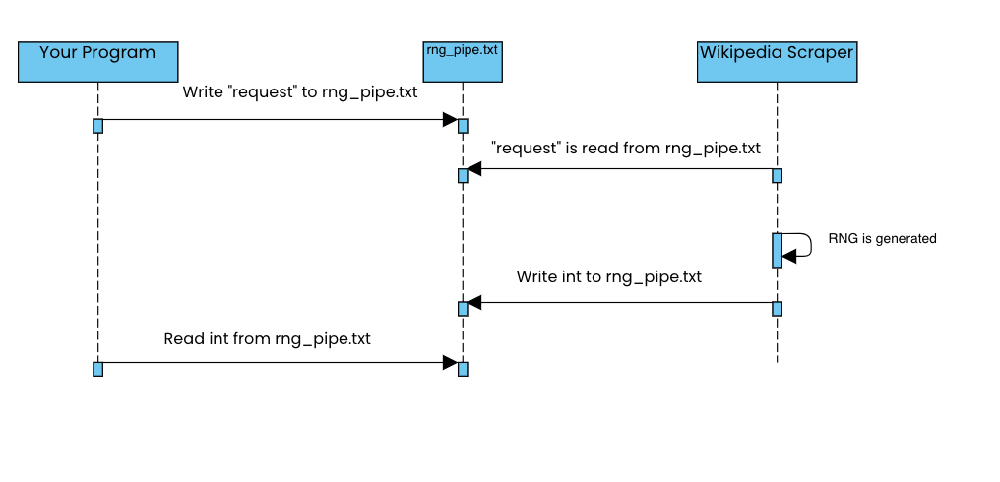

# cs361-wikipedia-scraper

## Microservice Instructions
The microservice that is implemented is a psuedo random number generator that produces an integer from 1 to 5, inclusive of both ends. 

In order to programatically request data, there is a txt file called rng_pipe.txt. While the rng_microservice.py program is running, simply write "request" into that file, and on the next read check see that a request has been submitted and it will generate a rng and overrite the file with that random number. At this point you can read from the file, and as long as it is not empty or filled with just "request", you should be able to grab the int from it.

## Example Request Call

## write_to_txt_file Function

This function writes a given string to a text file specified by the file path. It overwrites the file contents if the file already exists. Simply fill in the file_path as "rng_pipe.txt" and the str_to_write as "request".

### Parameters:

- `file_path` (string): The file path where the content will be written.
- `str_to_write` (string): The string that will be written to the file.

### Usage:

```python
def write_to_txt_file(file_path, str_to_write):
    try:
        with open(file_path, 'w') as file:
            file.write(str_to_write)
        print("File written successfully.")
    except Exception as e:
        print(f"Error occurred while writing to the file: {e}")
```

## check_txt_file_contents Function

This function checks whether the contents of a text file specified by the file path are equal to a given string. Use this to check the contents of "rng_pipe.txt" to see if it is filled with an int. 

### Parameters:

- `file_path` (string): The file path of the text file to be checked.
- `str_to_check` (string): The string to compare with the contents of the file.

### Returns:

- `True` if the file contents match the given string.
- `False` if the file contents do not match the given string or if there was an error during the process.

### Usage:

```python
def check_txt_file_contents(file_path, str_to_check):
    try:
        with open(file_path, 'r') as file:
            file_content = file.read()

            if file_content.strip() == str_to_check:
                return True
            else:
                return False
    except FileNotFoundError:
        print(f"File not found: {file_path}")
        return False
    except Exception as e:
        print(f"Error occurred: {e}")
        return False
```

### UML Diagram of the Communication Pipe

